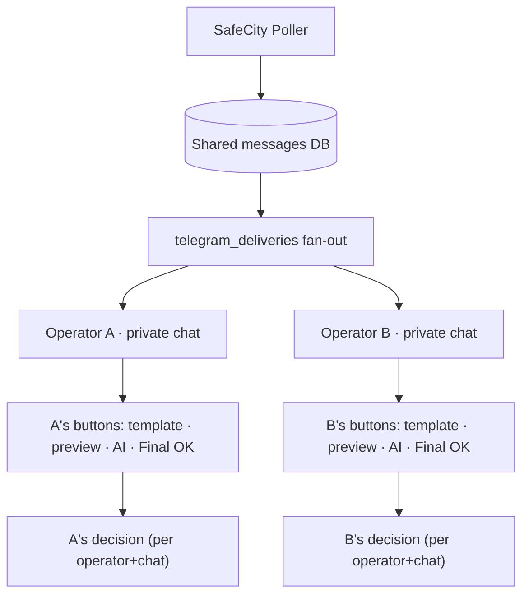

# Independent Telegram Operators (v0.4.0)

Every authorized operator is an **equal, independent entity**. There is no
primary operator, no default chat, and no broadcast recipient. The SafeCity
collector and the `messages` database stay **shared**; everything an operator
*experiences* — automatic delivery, commands, previews, Final-OK decisions,
on-demand AI, and mute/subscribe state — is **personal and isolated**.

`TELEGRAM_CHAT_ID` is retained only as a legacy migration/bootstrap value. It
is never the operational automatic-delivery target and is never used as an
interactive fallback.

## Architecture

- **Shared**: SafeCity collection, dedup, the `messages` table, run history,
  retention.
- **Personal**: subscription/mute state, automatic delivery + retry, every
  interactive reply, previews, decisions, and AI generations — each keyed to
  the operator (`user_id`) and their private chat (`interaction_chat_id`).

## Roles of the three env values

| Setting | Role in v0.4.0 |
| --- | --- |
| `TELEGRAM_ALLOWED_USER_IDS` | The operators. Anyone here may operate the bot and hold a personal subscription. |
| `TELEGRAM_SEND_ENABLED` | Global master switch for **all** automatic delivery. Not an individual mute. |
| `TELEGRAM_CHAT_ID` | Legacy migration/bootstrap only. Never the automatic target, never an interactive fallback. |
| `TELEGRAM_AI_WORKERS` | Size (1–4, default 2) of the bounded pool that runs on-demand AI off the main loop. |

## Personal subscriptions (`telegram_subscriptions`)

One row per operator: `user_id` (unique), `chat_id` (unique, the operator's
private chat), `chat_type`, `status` (`active` / `muted` / `unsubscribed`),
`registration_source`, and timestamps.

- Created **active** on the first authorized *private* interaction (message or
  button). A muted/unsubscribed operator is **never** silently reactivated by
  ordinary interaction — only `/subscribe` or `/unmute` may reactivate.
- `list_active_subscriptions(allowed_user_ids)` returns only active, private
  subscriptions whose user is still in `TELEGRAM_ALLOWED_USER_IDS`. A user
  removed from the allowed set is excluded even if a stale active row remains.

### Commands

| Command | Effect |
| --- | --- |
| `/subscribe` | Start/re-activate automatic delivery to **this** private chat. |
| `/unsubscribe` | Stop automatic delivery entirely (구독 해제). |
| `/mute` (`/pause`) | Temporarily silence **your** automatic delivery. Never affects other operators or shared polling. |
| `/unmute` (`/resume`) | Resume your automatic delivery. |
| `/status` | Two sections: `[내 알림 상태]` (your own) + `[공통 수집 상태]` (shared). Never shows another operator's ids. |

All operational commands and inline buttons are **private-chat only**. A
group/supergroup/channel action is acknowledged (the spinner stops) and
rejected in place with `[개인 채팅에서 사용해 주세요] …` — it is never processed
and never rerouted to a private chat.

## Per-recipient automatic delivery (`telegram_deliveries`)

Each genuinely new SafeCity record fans out to every active subscription, one
delivery row per recipient (`UNIQUE(message_id, subscription_id)`):

1. Store the source once.
2. `create_delivery_if_missing` for each active subscription (pending).
3. Send independently per recipient (`enforce_send_enabled=True`), marking each
   row `sent` / `failed` / left `pending` (global switch off).
4. One recipient's failure never blocks the others.

Retries are driven by `list_retryable_deliveries()` (pending/failed rows on
active private subscriptions for non-baseline messages) — **never** by
`messages.telegram_status`. A `sent` row is never re-sent.

- **No fallback**: with zero active subscriptions a new record is stored and a
  WARNING is logged; nothing is sent to `TELEGRAM_CHAT_ID`.
- **No backfill**: a newly subscribed operator receives only *future*
  messages; older messages fanned out before they subscribed produce no row
  for them.

`messages.telegram_status` and `messages.telegram_message_id` are kept as
**backward-compatible aggregates** derived from `telegram_deliveries` (all
recipients sent → `telegram_sent`; any failed/pending → failed/pending;
`telegram_message_id` holds the first success only, not per-user truth).

## Preview & decision isolation

Template selection, Rule/AI preview, Cancel, and Final OK are keyed to the
originating operator **and** chat. A confirm/cancel/AI callback may act on a
preview only if `preview.interaction_chat_id == chat` **and**
`preview.selected_by == user` — a different chat or a different (even
authorized) operator is rejected with `[사용할 수 없는 요청]`.

`template_decisions` uses `UNIQUE(message_id, confirmed_by,
interaction_chat_id)`, so two operators can hold independent, coexisting
decisions for the same source message, and one operator reconfirming updates
their own row in place (idempotent). `template_actions` and `ai_generations`
carry `interaction_chat_id` for independent auditability.

## Non-blocking AI

On-demand AI generation runs on a bounded `ThreadPoolExecutor`
(`TELEGRAM_AI_WORKERS`) owned by the bot:

- Non-AI callbacks stay synchronous.
- An AI callback is acknowledged immediately, validated (ownership/active/
  duplicate) synchronously, then submitted to the pool. The duplicate guard is
  marked processed **only after** a successful submit — a submit failure stays
  retryable and replies `[AI 요청 처리 불가]`.
- The AI worker opens its **own** `Database` + `TelegramSender` (no sqlite
  connection shared across threads), re-validates ownership/active on execution,
  and delivers the result only to the originating operator's chat.
- One operator's slow/blocked AI request never blocks another operator's
  non-AI commands.

## Migration (v0.3.0 → v0.4.0)

Idempotent and atomic:

- `template_actions.interaction_chat_id`, `ai_generations.interaction_chat_id`
  added (nullable).
- `template_decisions` rebuilt to the per-operator `UNIQUE` constraint,
  preserving every decision and its immutable source snapshots;
  `interaction_chat_id` is recovered from the confirming preview or defaults to
  the literal `'legacy'`.
- New `telegram_subscriptions` and `telegram_deliveries` tables.
- One-time subscription bootstrap seeds active peers from distinct historical
  private Preview owners (`selected_by` + `interaction_chat_id`) for authorized
  users, then the legacy `TELEGRAM_CHAT_ID` **only** when it is a positive/
  private chat that maps unambiguously to exactly one still-unseeded allowed
  user. Negative group ids are never seeded and an owner is never guessed.

Validated on a copy of the production DB (never mutating it): counts and
snapshots preserved, decisions readable via `get_decision_for_operator`, and
idempotent across repeated open/close.

## Offline validation

`python -m app.commands.validate_telegram_behavior` exercises the whole model
with synthetic operators A/B and a group chat (no network) and prints an
`Independent operator validation` PASS/FAIL block (non-zero exit on failure).
